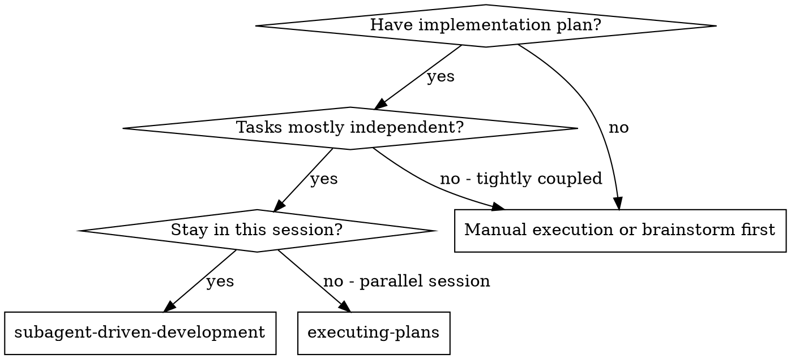
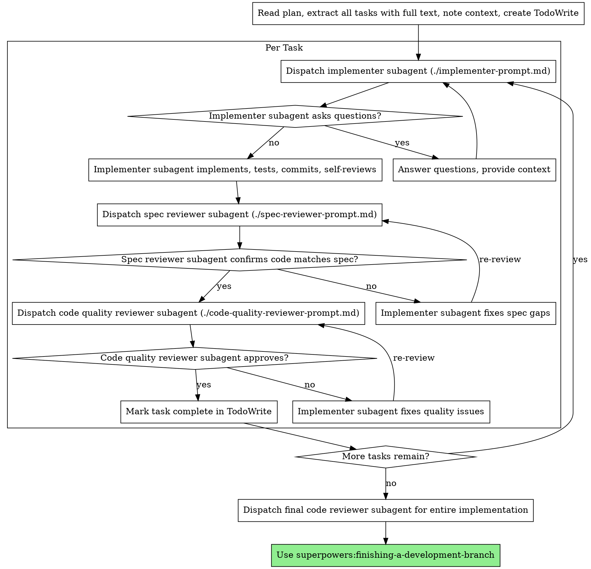

# Subagent-Driven Development

Execute plan by dispatching fresh subagent per task, with two-stage review after each: spec compliance review first, then code quality review.

**Why subagents:** You delegate tasks to specialized agents with isolated context. By precisely crafting their instructions and context, you ensure they stay focused and succeed at their task. They should never inherit your session's context or history — you construct exactly what they need. This also preserves your own context for coordination work.

**Core principle:** Fresh subagent per task + two-stage review (spec then quality) = high quality, fast iteration

## When to Use



**vs. Executing Plans (parallel session):**
- Same session (no context switch)
- Fresh subagent per task (no context pollution)
- Two-stage review after each task: spec compliance first, then code quality
- Faster iteration (no human-in-loop between tasks)

## The Process



## Model Selection

Use the least powerful model that can handle each role to conserve cost and increase speed.

**Mechanical implementation tasks** (isolated functions, clear specs, 1-2 files): use a fast, cheap model. Most implementation tasks are mechanical when the plan is well-specified.

**Integration and judgment tasks** (multi-file coordination, pattern matching, debugging): use a standard model.

**Architecture, design, and review tasks**: use the most capable available model.

**Task complexity signals:**
- Touches 1-2 files with a complete spec → cheap model
- Touches multiple files with integration concerns → standard model
- Requires design judgment or broad codebase understanding → most capable model

## Handling Implementer Status

Implementer subagents report one of four statuses. Handle each appropriately:

**DONE:** Proceed to spec compliance review.

**DONE_WITH_CONCERNS:** The implementer completed the work but flagged doubts. Read the concerns before proceeding. If the concerns are about correctness or scope, address them before review. If they're observations (e.g., "this file is getting large"), note them and proceed to review.

**NEEDS_CONTEXT:** The implementer needs information that wasn't provided. Provide the missing context and re-dispatch.

**BLOCKED:** The implementer cannot complete the task. Assess the blocker:
1. If it's a context problem, provide more context and re-dispatch with the same model
2. If the task requires more reasoning, re-dispatch with a more capable model
3. If the task is too large, break it into smaller pieces
4. If the plan itself is wrong, escalate to the human

**Never** ignore an escalation or force the same model to retry without changes. If the implementer said it's stuck, something needs to change.

## Prompt Templates

- `./implementer-prompt.md` - Dispatch implementer subagent
- `./spec-reviewer-prompt.md` - Dispatch spec compliance reviewer subagent
- `./code-quality-reviewer-prompt.md` - Dispatch code quality reviewer subagent

## Example Workflow

```
Command 1: Jarvis

Command 2: 'prompt'
Phase 1: Foundations
Start by learning Python, APIs, basic data structures, and how modern AI assistants work. In this phase, your goal is not a full Jarvis; it is to understand how a program talks to an LLM, stores state, and triggers actions.[scribd +1]
Build tiny exercises: text input, API calls, simple command routing, and a basic chat loop.[scribd]
Phase 2: Single-purpose assistant
Create one narrow assistant that does one thing well, such as scheduling, search, or file handling. This is where you first connect natural language to real actions through a small tool set.[aisera +1]
Keep the scope limited so you can test reliability before adding memory, voice, or more tools.[machinelearningmastery +1]
Phase 3: Memory and identity
Add short-term session memory first, then long-term memory for preferences and important facts. Enterprise guidance emphasizes memory as a distinct architecture layer, not just chat history.[atlan +2]
Next, define the assistant’s identity: role, tone, boundaries, permissions, and escalation behavior. That is the practical meaning of “soul” in an enterprise system.[covasant +1]
Phase 4: Tool orchestration
After memory, build the orchestration layer that decides which tool or service to use for each task. Production systems rely on planning, delegation, fallbacks, and workflow routing rather than one giant prompt.[kore +2]
At this stage, connect only a few trusted tools, and make every action reversible or reviewable where possible.[deloitte +1]
Phase 5: Security and governance
Before scaling autonomy, add least-privilege access, human approval for risky actions, encryption, and prompt-injection defenses. Enterprise sources consistently treat governance as mandatory once the agent can write to real systems.[linkedin +3]
Log every important decision, tool call, and outcome so you can audit what happened later.[versa-networks +2]
Phase 6: Observability and testing
Add tracing, metrics, and structured logs so you can see where the assistant succeeds or fails. Monitoring should cover latency, tool error rates, user satisfaction, and cost per task.[truefoundry +1]
Test the system with simulated failures, bad inputs, and adversarial prompts before giving it broader access.[linkedin +1]
Phase 7: Scale and specialize
Once one workflow is stable, expand to adjacent workflows and reuse the same memory schema, policy layer, and orchestration patterns. Enterprise roadmaps recommend scaling horizontally only after one use case is validated.[techment +1]
This is also where you can add voice, multi-agent delegation, and deeper integrations with enterprise systems.[assemblyai +1]
Learning order
A good beginner order is: Python, APIs, prompt design, memory, tool calling, security, then orchestration and observability. That sequence gives you a working assistant early while preventing the common mistake of building autonomy before control.
```

## Advantages

**vs. Manual execution:**
- Subagents follow TDD naturally
- Fresh context per task (no confusion)
- Parallel-safe (subagents don't interfere)
- Subagent can ask questions (before AND during work)

**vs. Executing Plans:**
- Same session (no handoff)
- Continuous progress (no waiting)
- Review checkpoints automatic

**Efficiency gains:**
- No file reading overhead (controller provides full text)
- Controller curates exactly what context is needed
- Subagent gets complete information upfront
- Questions surfaced before work begins (not after)

**Quality gates:**
- Self-review catches issues before handoff
- Two-stage review: spec compliance, then code quality
- Review loops ensure fixes actually work
- Spec compliance prevents over/under-building
- Code quality ensures implementation is well-built

**Cost:**
- More subagent invocations (implementer + 2 reviewers per task)
- Controller does more prep work (extracting all tasks upfront)
- Review loops add iterations
- But catches issues early (cheaper than debugging later)

## Red Flags

**Never:**
- Start implementation on main/master branch without explicit user consent
- Skip reviews (spec compliance OR code quality)
- Proceed with unfixed issues
- Dispatch multiple implementation subagents in parallel (conflicts)
- Make subagent read plan file (provide full text instead)
- Skip scene-setting context (subagent needs to understand where task fits)
- Ignore subagent questions (answer before letting them proceed)
- Accept "close enough" on spec compliance (spec reviewer found issues = not done)
- Skip review loops (reviewer found issues = implementer fixes = review again)
- Let implementer self-review replace actual review (both are needed)
- **Start code quality review before spec compliance is ✅** (wrong order)
- Move to next task while either review has open issues

**If subagent asks questions:**
- Answer clearly and completely
- Provide additional context if needed
- Don't rush them into implementation

**If reviewer finds issues:**
- Implementer (same subagent) fixes them
- Reviewer reviews again
- Repeat until approved
- Don't skip the re-review

**If subagent fails task:**
- Dispatch fix subagent with specific instructions
- Don't try to fix manually (context pollution)

## Integration

**Required workflow skills:**
- **superpowers:using-git-worktrees** - REQUIRED: Set up isolated workspace before starting
- **superpowers:writing-plans** - Creates the plan this skill executes
- **superpowers:requesting-code-review** - Code review template for reviewer subagents
- **superpowers:finishing-a-development-branch** - Complete development after all tasks

**Subagents should use:**
- **superpowers:test-driven-development** - Subagents follow TDD for each task

**Alternative workflow:**
- **superpowers:executing-plans** - Use for parallel session instead of same-session execution
